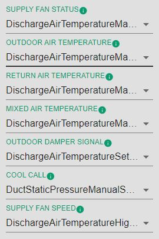
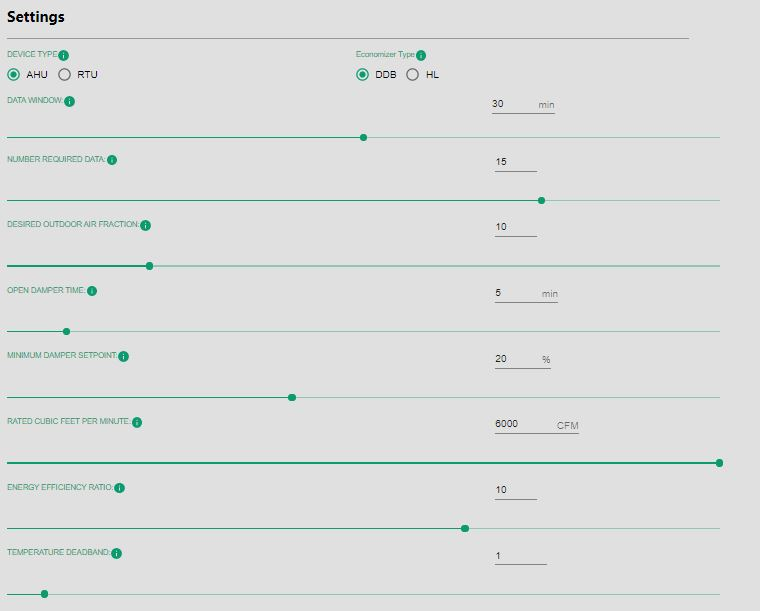
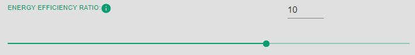
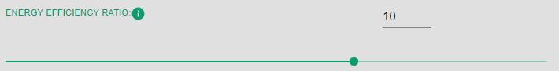
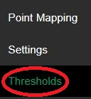
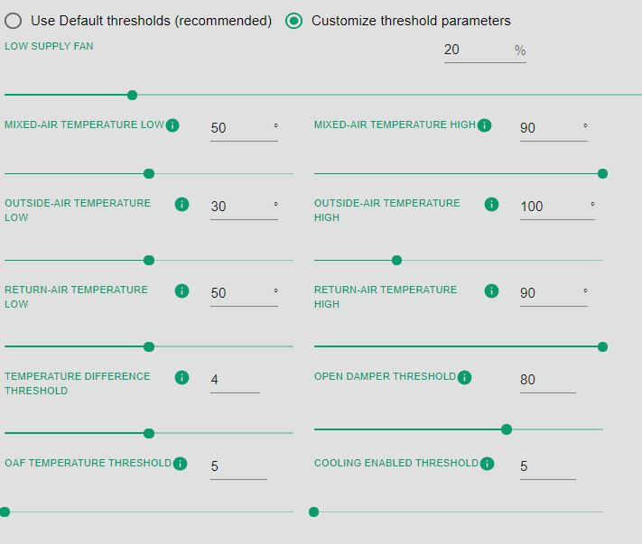
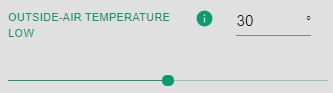
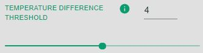
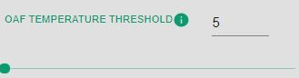

.. AHU configuration User Guide documentation master file, created by
   sphinx-quickstart on Mon Aug 17 17:12:11 2020.
   You can adapt this file completely to your liking, but it should at least
   contain the root `toctree` directive.

########################################
AHU Economizer Configuration User Guide:
########################################

Importing Master Driver Configuration Store
*******************************************
At the initial homepage, the user will be prompted to upload the **Master Driver** file. Values within the Master Driver Configuration Store will be parsed to provide options for Campus, Buidling, Device and Points throughout the application.

.. image:: _images/ahu_Frontpage.JPG

Once the user has selected the Master Driver Configuration Store, this homepage will not appear again. However, if the user needs to upload a different Master Driver Configuration Store at any point, this option can be accessed via the Menu icon in the top left of the application.

.. Warning:: Uploading a new Master Driver Configuration Store will remove all current data in the application.

.. image:: _images/master_Driver.JPG

After a *Master Driver* File is uploaded, there will be two new buttons that will appear 
as green below. 

Below The *Master Driver* button, there are two buttons that say:
*AHU File* and *Generate configuration file for...* The *Ahu File* will allow the user to submit a file that has been created by the AHU config 
previously, and the *Generate configuration file for...* will allow the user to create a new configuration file for either the *ECONOMIZER* or *AIRSIDE*. 

Economizer
**********

This section will go over all of the items that are located within the *Economizer* button located in the *Generate configuration file for...* 
button. 

When the Economizer is selected there will be a prompt to select *Campus*,
*Building*, and *Device*. These will all be selected as dropdown inputs. 

AHU Application Configuration
*****************************

The *AHU* Application behavior is controlled through these
configuration Pages:

1.  **Point Mapping**
2.  **Settings**
3.  **Thresholds**

Point Mapping
*************
*Point Mapping* will be the first tab on the left side of the Economizer page. This will be 
located underneath the main configuration file and the *Default Economizer*. 

Once *Point Mapping* is selected, configurations will show on the center of the screen. 

Once the configuration is shown in the center of the screen, the dropdown inputs 
may be selected to configure. 

All of the *Point Mapping* configuration settings will be drop down inputs that are dependant Upon the 
main configuration file selected for the page. 

JSON
****

Throughout the AHU application, there is a page on the right hand side of the screen with 
visual accessibility of the JSON code. As items are input into the tab sections of the application 
the JSON code will populate with its corresponding items. 

For Example: When a *Device(s)* is chosen on on the first page, the *JSON* code will populate
with those same chosen devices. 

**JSON Example**: At the start of the *Economizer* page when the user is prompted to input a *Device*, there is 5 options to choose from: 

After the device is chosen there will be a dropdown of devices to choose from. 

As these devices are chosen, they will be stored within the *Json* code on the right side of the page as items
are selected.

Settings
********

Settings is the second tab inside of the Ahu configuration Economizer section. 
Once settings is selected the center section will populate with configurations. 

**Device Type**

*Device Type* will give you an option to either choose *AHU* or *RTU* underneath the settings 
title. 

**Economizer Type**

Economizer type has two selections: *DDB* and *HL*.
Choosing one will provide specific configuration settings.

Economizer Type: DDB
********************

**Data Window**

This selection will be an integer type ranging from 0 to 60 minutes. 
The user may input an integer or use the slider to obtain the number required.

**Numbered Required Data**

This selection will be an integer type ranging from 0 to 20. 
The user may input an integer or use the slider to obtain the number required.

**Desired Outdoor Air Fraction**

This selection will be an integer type ranging from 5 to 30. 
The user may input an integer or use the slider to obtain the number required.

**Open Damper Time**

This selection will be an integer type ranging from 0 to 60 minutes. 
The user may input an integer or use the slider to obtain the number required.

**Minimum Damper Setpoint**

This selection will be an integer type ranging from 0 to 50 %. 
The user may input an integer or use the slider to obtain the number required.

**Rated Cubic Feet Per Minute**

This selection will be an integer type ranging from 0 to 6000 CFM. 
The user may input an integer or use the slider to obtain the number required.

**Energy Efficient Ratio**

This selection will be an integer type ranging from 1 to 15. 
The user may input an integer or use the slider to obtain the number required.

**Temperature Deadband**

This selection will be a floating point number ranging from 0.5 to 10. 
The user may also input a floating point number or use the slider to obtain the number required.

Economizer type: HL
*******************
The *Economizer* type *HL* will be the next selection. Once this option is selected, 
there will be new settings that the user may configure. 

**Economizer Switchover Setpoint**

This selection will be a integer number ranging from 0 to 20. 
The user may input an integer or use the slider to obtain the number required.

**Data window**

This selection will be a floating point number ranging from 0 to 60 minutes. 
The user may input an integer or use the slider to obtain the number required.

**Number Required Data**

This selection will be a floating point number ranging from 0 to 60 minutes. 
The user may input an integer or use the slider to obtain the number required.

**Desired Outdoor Air Fraction**

This selection will be a floating point number ranging from 5 to 30. 
The user may input a floating point number or use the slider to obtain the number required.

**Open Damper Time**

This selection will be a floating point number ranging from 0 to 60 minutes. 
The user may input an integer or use the slider to obtain the number required.

**Minimum Damper Setpoint**

This selection will be a floating point number ranging from 0 to 50%. 
The user may input an integer or use the slider to obtain the number required.

**Rated Cubic Feet Per Minute**

This selection will be a floating point number ranging from 0 to 6000 CFM. 
The user may input an integer or use the slider to obtain the number required.

**Energy Efficient Ratio**

This selection will be a floating point number ranging from 1 to 15. 
The user may input an integer or use the slider to obtain the number required.

**Temperature Deadband**

This selection will be a floating point number ranging from 1 to 15. 
The user may input an integer or use the slider to obtain the number required.

.. image:: _images/Temp_Dead.JPG

Thresholds
**********

The last tab in the AHU config: Economizer is the *Threshold* tab. 

Once this tab is selected, there will be two options that appear on the center of the screen. 

If *Use Default thresholds** is selected, there will be no options to configure.

If *Customize Threshold Parameters* is selected, there will be new settings to configure. 

**Low Supply Fan**

This selection will be a floating point number ranging from 0 to 100%. 
The user may input an integer or use the slider to obtain the number required.

**Mixed-Air Temperature Low**

This selection will be a floating point number ranging from 40 to 60 degrees. 
The user may input an integer or use the slider to obtain the number required.

**Mixed-Air Temperature High**

This selection will be a floating point number ranging from 80 to 90 degrees. 
The user may input an integer or use the slider to obtain the number required.

**Outside-Air Temperature Low**

This selection will be a floating point number ranging from 20 to 40 degrees. 
The user may input an integer or use the slider to obtain the number required.

**Outside-Air Temperature High**

This selection will be a floating point number ranging from 90 to 125 degrees. 
The user may input an integer or use the slider to obtain the number required.

**Return-Air Temperature Low**

This selection will be a floating point number ranging from 40 to 60 degrees. 
The user may input an integer or use the slider to obtain the number required.

**Return-Air Temperature High**

This selection will be a floating point number ranging from 80 to 90 degrees. 
The user may input an integer or use the slider to obtain the number required.

.. image:: _images/return_High.JPG

**Temperature Difference Threshold**

This selection will be a floating point number ranging from 2 to 6. 
The user may input an integer or use the slider to obtain the number required.

**Open Damper Threshold**

This selection will be a floating point number ranging from 60 to 90. 
The user may input an integer or use the slider to obtain the number required.

**OAF Temperature Threshold**

This selection will be a floating point number ranging from 5 to 15. 
The user may input an integer or use the slider to obtain the number required.

**Cooling enabled Threshold**

This selection will be a floating point number ranging from 5 to 50. 
The user may input an integer or use the slider to obtain the number required.

Saving Files
************

Once everything within the *Economizer* is configured, the last option will be to save the
AHU file. 

Once the *Save as* button is selected, a new input will appear in the center of the screen. 

This will allow the user to name the file whatever is desired. The file will automatically create 
the file as a *.json* file as well. 

Once the save button is chosen, it will download to the browser as the file it was named. 

.. toctree::
   :maxdepth: 2
   :caption: Contents: